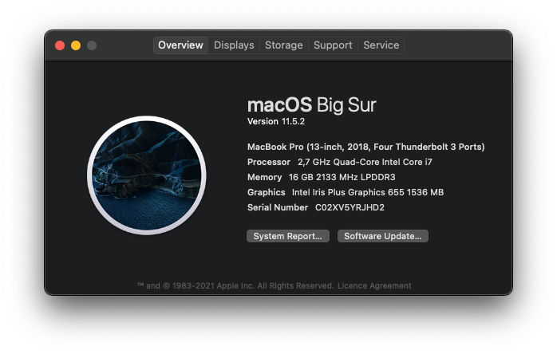

I had never used macOS before in my life apart from the occasional messing about if I come across a computer shop. But for work reasons I felt I needed to get to know it better. That triggered me trying out a Macbook Pro for the first time and go through the pain of shifting from Windows.

I have mainly used Windows during my professional career but also run Linux as my daily driver for a few stints, and very frequently on the side on personal machines. So I was familiar with the "unix" way somewhat and also just been generally curiuos about macOS for a while. What the fuss is about.

The machine I got has the following specs:



I made notes on the side as I tested it over the first few weeks and here are some of the pros and cons I noticed compared to Windows and Linux:

**Pros:**

* I really like the ```Cmd```/```Option``` options to move or delete single words or full lines at a time.

* Props for the Easy Move+Risize app. I've gotten hooked on the Linux (at least Gnome) built-in hold alt + left or right-click the mouse to move or resize windows. I use AltSnap on Windows now for this.

* I *love* the touchpad and keyboard. Heard this repeatedly throughout the years from Mac enthusiast over the years but, yeah, it's true. Get to know the gestures as well and watch a couple YouTube videos about how to configure the default to your liking. For me I set three-finger drag at least and enabled tap to click. The four-finger draps upwards to show all windows and right-left to move between virtual workspaces is also super nice. They've borrowed some of this from Linux and later on Windows stole this as well with Windows 11.

* Smooth UI transitions vs. Windows although Linux is in my view more smooth in many ways than Window as well. Moving windows around, switching workspaces. Plugging in/out of a dock with an external monitor. Windows know where they should be an it's consistent. Windows struggles with this and is all janky somehow.

* Consistency in both UI and UX. For example then ```Cmd + ,``` is *always* the shortcut to the settings menu of an app. Also ```Cmd + q``` always kills an app.

* [Homebrew](https://brew.sh) and the App Store. Super nice. I am fond of the Linux package manager mentality for ease of discovery, installation and updates. This is the way for macOS. Windows is getting there with WinGet and Microsoft Store but ways to go still.

* Speakers and hardware in general miles ahead of what I've tried for Windows/Linux. Used mostly Lenovo and Dell.

* Consistent light/dark switch with OS features in apps. Windows is getting there. And the OS can switch depending on time of day. Don't think Windows can do that but Linux can (of course).

**Cons:**

* Screenshots are confusing but kind of gotten the hang of it using Shottr. May be a get-used-to-it thing. I use Greenshot on Windows.

* Caps lock delay. Oh shit this is annoying. Apparently a feature.

* Peripherals seem to sometimes have weird compatibility issues compared to Windows and Linux. For example connecting to a couple Lenovo docks I've used for a long time without a hitch for both Windows and Linux suddently needed some TLC to get to work with macOS. I have wide-screen monitors and a keyboard/mouse combo connected on both of these, one at home and one at work. Had to figure out how to make the OS realize which layout my keyboard was. Lots of jumping through hoops until it suddenly worked. Not sure why.

* Widgets (from the top-right) not that useful. E.g. getting a quick view of the calendar not possible in macOS, I have to click through to open the Calendar app. This is trivial both on Windows and Linux.

* It's a meme by now but I am firm on that macOS updates take way longer than Windows updates. 

To summarize though, I very much like the consistency, simplicity and general *feel* of the machine. Once you're up and running it's just so smooth. No nitpicks that you're so used to with Windows (funnily enough, often related to location, size or displaying of ... windows). Since this initial experiment I've gotten a newer more powerful machine; Macbook Pro 2021 M1. Huge difference in performance, like it even more. I will still continue to take turns, I need to be familiar with both macOS and Windows functionality and setup, but I do tend to like switching it up regularly so no complaints.

A few random pointers for newcomers to macOS, in no particular order:

1. Go to YouTube and pick 2-3 videos at least about getting to know macOS and how to configure some basic things.
1. Consider installing some of these that I've found useful:
    * [Raycast](https://www.raycast.com/) - monster upgrade from Spotlight.
        * ```brew install --cask raycast```
    * [Rectangle](https://rectangleapp.com/) - for window management/placement.
        * ```brew install --cask rectangle```
    * [Easy Move+Resize](https://formulae.brew.sh/cask/easy-move-plus-resize#default) - as described above
        * ```brew install --cask easy-move-plus-resize```
    * [Flux]() - for managing night light on an external monitor, seems macOS can't handle that for all external monitors.
    * [Shottr](https://shottr.cc/) - for screenshots, if you're overwhelmed by [the macOS shortcuts features](https://support.apple.com/en-is/guide/mac-help/mh26782/mac).
        * ```brew install --cask shottr```
1. Be warned that the first few days will be *very* annoying, just while you go through the pain of your regular keyboard habits don't work as well. Account for *at least* a month to get used to a new way of working, preferably two. Only after that time you can start to make real complaints.

Thanks for reading.